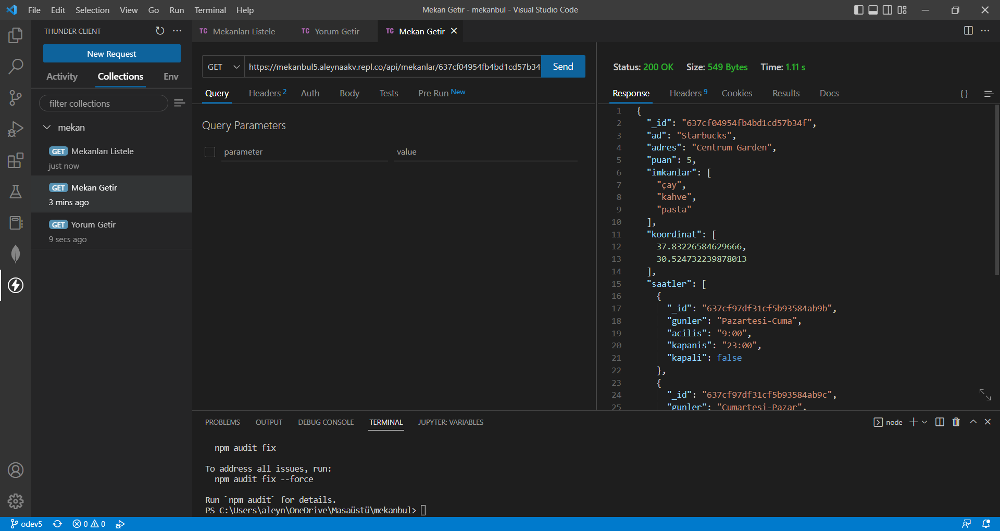
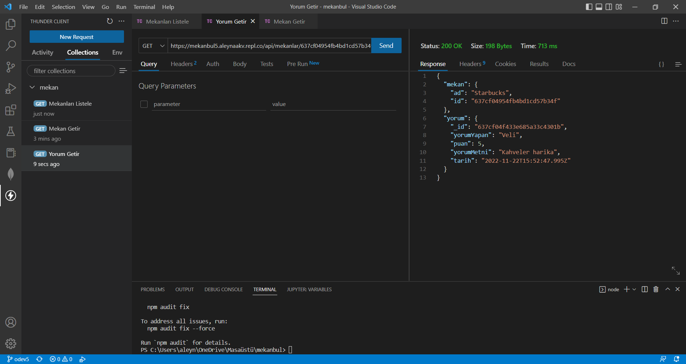

# MekanBul REST API Adresleri

1. [Girilen Konum Civarındaki Mekanları Listele](https://mekanbul5.aleynaakv.repl.co/api/mekanlar?enlem=37.8&boylam=35.4)

2. [Mekanın IDsi İle Mekan Bilgilerini Getir](https://mekanbul5.aleynaakv.repl.co/api/mekanlar/637cf04954fb4bd1cd57b34f)

3. [Bir Mekana Ait Belirli Bir Yorumu Getir](https://mekanbul5.aleynaakv.repl.co/api/mekanlar/637cf04954fb4bd1cd57b34f/yorumlar/637cf04f433e685a33c4301b)

# Odev6 
1. Mekanları Listele (./images/mekanlistele.png)
2. [Mekan Getir](./images/mekangetir.png)
3. [Mekan Ekle](./images/mekanekle.png)
4. [Mekan Güncelle](./images/mekanguncelle.png)
5. [Yorum Listele](./images/yorumgetir.png)
6. [Yorum Ekle](./images/yorumekle.png)
7. [Yorum Güncelle](./images/yorumguncelle.png)
8. [Yorum Sil](./images/yorumsil.png)
9. [Mekan Sil](./images/mekansil.png)
